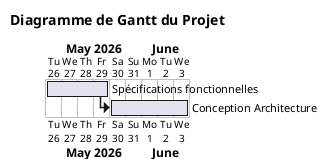

---

# scriptUML

Convertit des données CSV en diagrammes de Gantt compatibles PlantUML directement depuis le navigateur.

## Aperçu

Ce projet permet de :

* importer des tâches au format CSV,
* générer automatiquement du code PlantUML,
* gérer les dépendances entre tâches,
* afficher l’avancement des tâches,
* associer des ressources aux tâches,
* exporter le résultat en `.puml`.

Le projet fonctionne entièrement côté client avec :

* HTML
* CSS
* JavaScript vanilla

Aucune dépendance externe ni backend requis.

---

## Fonctionnalités

* Génération instantanée de diagrammes Gantt PlantUML
* Gestion des dépendances (`PREDECESSEURS`)
* Gestion des ressources (`QUI`)
* Progression des tâches (`0 → 100`)
* Export `.puml`
* Copie dans le presse-papiers
* Exemple de projet intégré
* Interface responsive moderne
* Fermeture des samedis/dimanches configurable

---

## Format CSV attendu

```csv
DUREE(DAYS),PREDECESSEURS,NOM_TACHE,REALISE_OUI_OU_NON_OU_POURCENTAGE,QUI
4,-,Spécifications fonctionnelles,100,DamienChef
5,Spécifications fonctionnelles,Conception Architecture,100,DamienArchitecte
3,Conception Architecture,Modélisation Base de Données,100,DamienArchitecte/LeadDamien
8,Modélisation Base de Données,Développement Backend API,50,LeadDamien/DamienDev
```

---

## Exemple de génération PlantUML



---

## Structure du projet

```text
/
├── index.html
├── styles.css
├── app.js
└── README.md
```


## Utilisation

1. Coller les données CSV
2. Configurer :

   * date de début,
   * titre du projet,
   * jours fermés
3. Cliquer sur `Générer`
4. Copier ou télécharger le `.puml`
5. Visualiser le résultat sur :
   [PlantUML Online](https://www.plantuml.com/plantuml/uml/)

---

## Auteur

Projet réalisé par [Damien Ballerat](https://codefirst.iut.uca.fr/kubernetes/daballerat/damien-portfolio/)
